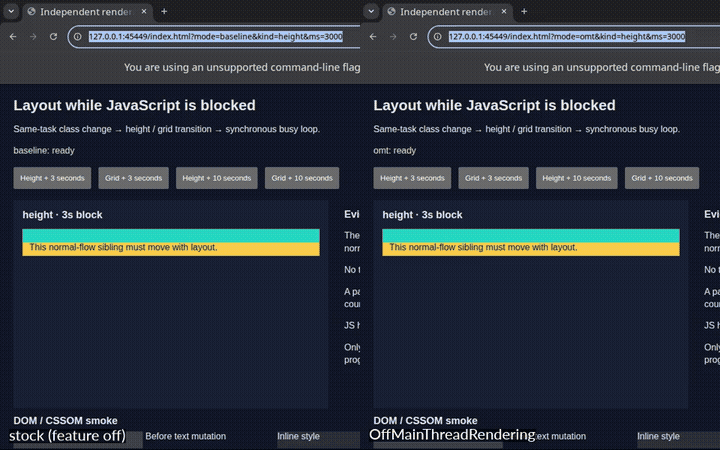

# Chromium Multi-threading

A patch for **Chromium 153** (Linux) that keeps pages animating while JavaScript is busy.

In normal Chrome, one thread does everything for a page: it runs JavaScript *and* draws the page. If a script runs a long
loop, the page freezes until it finishes. This patch gives each page a second thread that can draw the page while the first one
is stuck.



*Left: normal Chrome. The panel freezes while JavaScript runs a 3-second loop. Right: with the patch, the panel keeps
growing.*

## How it works

- **Normally nothing changes.** The main thread runs JavaScript and draws the page as usual. A second "render thread" quietly
  keeps its own copy of the page up to date in the background. It doesn't draw anything.
- **When JavaScript runs for more than 50 ms**, the render thread takes over and starts drawing the page from its copy,
  including CSS animations.
- **When JavaScript finishes**, the main thread takes drawing back and continues the animations from where the render thread
  left off, so there's no jump.
- **If the script asks about layout** (for example `offsetHeight`) while the render thread is drawing, the render thread
  answers. The script sees the same sizes that are on screen.

Every page gets its own render thread. The animations that keep running are real layout animations (height, grid), not just the
simple ones the GPU could already handle alone.

## Results

A test harness runs the same Chrome build with the feature off and on. It records the screen independently of Chrome and checks
Chrome's own trace.

| Test | Normal Chrome | With the patch |
|---|---|---|
| Height animation during a 3 s JavaScript loop | frozen | keeps animating |
| Same during a 10 s loop | frozen | keeps animating |
| Layout values read by the script during the loop | stale | live, match the screen |
| Takes over after the loop starts | — | ~64 ms |
| Hands back after the loop ends | — | ~20–50 ms, no jump |
| Memory per page (idle) | 62–81 MB | 92–107 MB |

It was tested two ways, and both pass every check:

- **Virtual display (no GPU):** run `2026-09-27T06-08-28.532Z`.
- **Real GPU (RTX 4090, 60 Hz):** run `2026-09-27T06-16-54.769Z`. During a 3 s loop the panel changed height on 135 of the ~145
  screen refreshes while it was animating, so it animated at close to the full 60 fps.

Both runs are on the current build, with `` support. The checks also cover clicks, back/forward navigation, opening a second window, and memory under heavy page changes.

## Limits

- **Short loops aren't covered.** The takeover only happens after 50 ms, so short hiccups look the same as normal Chrome.
- **Many pages opt out.** Pages with video, canvas, iframes, most form fields, dialogs, web fonts, CSS background images,
  or animated, SVG or broken `` images are drawn the normal way. The render thread never loads anything itself; the
  main thread hands it finished results. For now that covers still `` images (PNG, JPEG, WebP and so on).
- **Scrolling with the mouse pauses** while the render thread is drawing. Scrolls done by the script are applied afterwards.
- **It uses more memory:** about 25 MB extra per page when idle, and more while a page is changing a lot.
- Linux only, and a research prototype. It isn't ready to be merged into Chromium.

## Try it

```sh
# In a Chromium checkout at tag 153.0.8010.55 (Linux)
cd src && git apply /path/to/patches/chromium-153.0.8010.55-omt.patch
gn gen out/Omt --args='is_debug=false is_component_build=true symbol_level=1'
autoninja -C out/Omt chrome
out/Omt/chrome --enable-blink-features=OffMainThreadRendering https://example.com/
```

Add `--enable-logging=stderr` to see `[OMT]` lines in the log when the render thread takes over and hands back.

## What's in this repo

| Folder | What |
|---|---|
| `patches/` | The whole change as one patch file. |
| `overlay/` | The new source files (the render thread and the change log it replays). |
| `validation/` | The test harness and a report for every run (`validation/results/*/REPORT.md`). |
| `smoke/` | Small test pages and scripts, including the GPU tests. |
| `audit/` | Notes on the shared state that had to be made safe for two threads. |
| `edits/` | History of the first version's edits. |
| `media/` | The comparison video above. |

For the technical details, see [`validation/README.md`](validation/README.md) and the code in
[`overlay/third_party/blink/renderer/core/render_thread/`](overlay/third_party/blink/renderer/core/render_thread).
